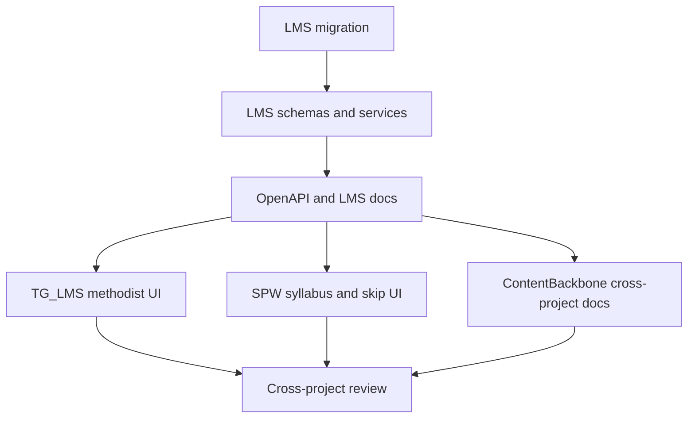

# ТЗ tsk-111: обязательность, пропуск и активность материалов и заданий

**Root:** `tsk-111`  
**Дата:** 2026-06-06  
**Проекты:** `D:\Work\LMS`, `D:\Work\TG_LMS`, `D:\Work\spw`, `D:\Work\ContentBackbone`  
**Основной режим:** `api-service` плюс `telegram-bot` и frontend-consumer SPW

## Цель

Добавить на уровне LMS API единый признак обязательности для материалов и заданий: `skippable` (`можно пропустить`), `recommended` (`желательно`), `required` (`обязательно`), а также включение/выключение задания и материала. В TG_LMS бот методиста должен уметь менять эти опции. В SPW нужно показывать пометки обязательности, давать кнопку пропуска только для `skippable` и отображать статус `skipped` / `пропущен`.

## Контекст

- LMS уже имеет `materials.is_active`, но у `tasks` нет `is_active`.
- У LMS нет отдельного поля обязательности у `materials` и `tasks`.
- `student_material_progress.status` сейчас ограничен значением `completed`; статуса `skipped` нет.
- Для заданий нет отдельной таблицы прогресса пропуска; состояние выводится из `task_results`.
- SPW потребляет `GET /api/v1/me/courses/{course_id}/syllabus-states`; это правильная точка расширения для статусов и пометок.
- TG_LMS уже умеет PATCH материалов и заданий, а у материалов уже есть UI-признаки активности.
- Cross-project правила из `CLAUDE.md`: при изменении endpoint/миграции обновить `D:\Work\ContentBackbone\docs\cross-project\contracts\lms-api.md`, `contracts/lms-db-schema.md`, `STATE.md`, `CHANGELOG.md` и сделать отдельный commit в ContentBackbone.

## Границы задачи

Входит:
- LMS миграции, модели, Pydantic-схемы, сервисы и тесты.
- Новые/расширенные API-контракты для CRUD, syllabus-states, learning skip.
- TG_LMS управление обязательностью и активностью в боте методиста.
- SPW отображение пометок, кнопка пропуска, статус `skipped`.
- Обновление `docs/openapi.json`, LMS docs и cross-project mirror.

Не входит:
- Перепроектирование всей учебной навигации.
- Массовая ручная разметка контента.
- Новые роли и ACL-модель.
- Изменение проверки ответов, очереди преподавателя и SA_COM review.

Не трогать:
- Секреты `.env`, `secrets/`, токены и реальные ключи.
- Существующие чужие незакоммиченные изменения без явной необходимости.
- Историю git и force push.

## Стек и ограничения

- LMS: FastAPI, Pydantic v2, SQLAlchemy async, Alembic, PostgreSQL.
- TG_LMS: aiogram 3.x, aiogram-dialog, httpx-клиент LMS.
- SPW: Next.js, TypeScript, TanStack Query.
- Новые поля должны быть обратно совместимыми: defaults сохраняют текущее поведение.
- Значения enum в API: `skippable`, `recommended`, `required`.
- Русские подписи UI: `можно пропустить`, `желательно`, `обязательно`.

## Карта предметных зависимостей

| Сущность | Сейчас | Требуемое состояние |
|---|---|---|
| `materials` | `is_active`, `order_position`; обязательности нет | добавить `requirement_level`, оставить `is_active` |
| `tasks` | `order_position`; `is_active` и обязательности нет | добавить `is_active`, `requirement_level` |
| `student_material_progress` | только `completed` | разрешить `completed`, `skipped`; добавить/использовать `skipped_at` |
| task skip | нет отдельного состояния | добавить `student_task_progress` для `skipped` |
| `syllabus-states` | статусы без обязательности | вернуть `requirement_level`, `is_active`, статус `skipped` |
| Learning Engine | все активные материалы/задания фактически блокируют маршрут | `required` блокирует, `skippable` блокирует до skip/complete/pass, `recommended` не блокирует next/course completion |

## Обязательные навыки/правила

- LMS backend: `fastapi-api-developer`.
- Миграции/инварианты: `db-check`.
- Кросс-проектная сверка: `context-auditor`.
- Бот методиста: `telegram-ux-flow-designer`.
- SPW проверка: frontend guidance + Browser/Playwright по локальному приложению.
- Финальное ревью: `lms-fastapi-techlead-code-reviewer` или `review-gate`.

## Шаги реализации

1. LMS preflight  
   **Executor:** `db-check`  
   **Review:** `context-auditor`  
   Проверить текущие колонки, constraints и OpenAPI: `materials`, `tasks`, `student_material_progress`, `task_results`, `docs/openapi.json`. Зафиксировать, что полей `requirement_level`, `tasks.is_active`, task skip state нет.

2. LMS миграция данных  
   **Executor:** `fastapi-api-developer`  
   **Review:** `db-check`, `lms-fastapi-techlead-code-reviewer`  
   Добавить Alembic revision:
   - `materials.requirement_level VARCHAR(16) NOT NULL DEFAULT 'required' CHECK IN (...)`;
   - `tasks.is_active BOOLEAN NOT NULL DEFAULT TRUE`;
   - `tasks.requirement_level VARCHAR(16) NOT NULL DEFAULT 'required' CHECK IN (...)`;
   - расширить `student_material_progress.status` до `completed | skipped`;
   - добавить `student_material_progress.skipped_at TIMESTAMPTZ NULL`, если поля нет;
   - создать `student_task_progress(student_id, task_id, status, skipped_at, created_at, updated_at)` с `status CHECK (status IN ('skipped'))`, PK `(student_id, task_id)`, FK cascade.
   Downgrade должен удалять новые поля/таблицу; для constraint расширения описать lossless/lossy часть.

3. LMS модели и схемы  
   **Executor:** `fastapi-api-developer`  
   **Review:** `context-auditor`  
   Обновить `app/models/materials.py`, `app/models/tasks.py`, новую модель task progress при необходимости. Обновить `MaterialCreate/Update/Read`, `MaterialsBulkUpsertItem`, `TaskCreate/Update/Read`, `TaskUpsertItem`. Значения по умолчанию: `requirement_level='required'`, `tasks.is_active=True`.

4. LMS сервисы и Learning Engine  
   **Executor:** `fastapi-api-developer`  
   **Review:** `lms-fastapi-techlead-code-reviewer`  
   Обновить:
   - `LearningEngineService._first_incomplete_material`: учитывать только `is_active=true`; `recommended` не должен блокировать next-item; `skippable` считается завершенным при `status='skipped'`.
   - `LearningEngineService._first_incomplete_task`: исключать `is_active=false`; `recommended` не блокирует; `skippable` считается завершенным при task progress `skipped`.
   - `compute_course_state` и `/me/courses` progress: обязательный прогресс считает `required + skippable`, где `skippable/skipped` считается satisfied; `recommended` считать отдельно только если решено добавить поля optional-progress, но не блокировать completion.
   - `get_syllabus_states`: вернуть все active элементы, включая `recommended`; inactive элементы не отдавать студенту.

5. LMS learning API для пропуска  
   **Executor:** `fastapi-api-developer`  
   **Review:** `lms-fastapi-techlead-code-reviewer`  
   Добавить endpoint:
   - `POST /api/v1/learning/materials/{material_id}/skip`
   - `POST /api/v1/learning/tasks/{task_id}/skip`
   Body совместим с текущим learning API: `{student_id: int}`.  
   Ответ: `{ok, student_id, kind, material_id?/task_id?, status: "skipped", skipped_at}`.  
   Правила:
   - 404 если элемента нет или `is_active=false`;
   - 409 если `requirement_level != 'skippable'`;
   - идемпотентный повторный skip возвращает 200 с существующим `skipped_at`;
   - для материала `completed` нельзя перезаписывать в `skipped`;
   - для задания с уже passed результатом skip не нужен: вернуть 409 `already_completed`.

6. LMS CRUD и bulk paths  
   **Executor:** `fastapi-api-developer`  
   **Review:** `context-auditor`  
   Проверить, что:
   - `PATCH /api/v1/tasks/{id}` меняет `is_active` и `requirement_level`;
   - `PATCH /api/v1/materials/{id}` меняет `is_active` и `requirement_level`;
   - bulk upsert материалов/заданий принимает `requirement_level`;
   - импорт Google Sheets не ломается при отсутствии новой колонки.

7. TG_LMS бот методиста  
   **Executor:** `telegram-ux-flow-designer` + `executor-pro`  
   **Review:** `context-auditor`  
   В `D:\Work\TG_LMS`:
   - обновить `src/common/models.py`: поля `requirement_level`, `is_active` для task-моделей;
   - обновить `AsyncAPIClient`/services при необходимости;
   - в карточке материала и задания показать активность и обязательность;
   - добавить действия: `Обязательность` -> выбор `можно пропустить / желательно / обязательно`;
   - добавить действие активности: `Включить` / `Выключить`;
   - PATCH отправлять только изменяемое поле;
   - после PATCH перечитать карточку и показать новое значение.

8. SPW контракт и UI  
   **Executor:** `executor-pro`  
   **Review:** `review-gate`  
   В `D:\Work\spw`:
   - обновить `lib/api-types.ts` из нового `docs/openapi.json`;
   - расширить `SyllabusStatus` значением `skipped`;
   - расширить item types полем `requirementLevel`;
   - в `CourseSyllabus`/`SyllabusItem` добавить пометку обязательности;
   - для `skippable` и не завершенного item показывать кнопку `Пропустить`;
   - кнопка вызывает новый LMS skip endpoint и инвалидирует `["learning","syllabus-states"]`, next-item и course progress;
   - статус `skipped` отображать как `пропущен`;
   - `recommended` показывать как `желательно`, но не считать блокером текущей секции.

9. Документация LMS и OpenAPI  
   **Executor:** `fastapi-api-developer`  
   **Review:** `context-auditor`  
   Обновить `docs/openapi.json`, `docs/learning-engine-next-item.md`, `docs/api-reference.md` или профильный API-документ, `docs/ai/data-model.md` при необходимости.

10. Cross-project фиксация  
    **Executor:** `project-docs`  
    **Review:** `context-auditor`  
    В `D:\Work\ContentBackbone\docs\cross-project\` обновить:
    - `contracts/lms-api.md`: новые поля, skip endpoints, расширение `syllabus-states`;
    - `contracts/lms-db-schema.md`: новые колонки/table/constraints и Alembic revision;
    - `STATE.md`: краткий статус LMS/TG_LMS/SPW;
    - `CHANGELOG.md`: запись `Project: LMS / Change: content requirement + skip + task active flag / Impact: TG_LMS, SPW / Authority: D:\Work\LMS\docs\specs\2026-06-06-tech-spec-tsk111-content-requirement-skip.md`.
    Затем отдельный commit в ContentBackbone: `git -C D:\Work\ContentBackbone add docs/cross-project && git -C D:\Work\ContentBackbone commit -m "cross-project: LMS content requirement and skip"`.

## Контракт навигации

- `required`: элемент блокирует next-item и завершение курса до `completed`/`passed`.
- `skippable`: элемент появляется в обычном маршруте; студент может нажать `Пропустить`; после `skipped` элемент не блокирует next-item и completion.
- `recommended`: элемент виден в syllabus с пометкой `желательно`, доступен по клику, но не блокирует next-item и completion.
- `is_active=false`: элемент скрыт из student-facing syllabus, next-item, progress и completion; методистский UI может видеть и включать обратно.

## Запрещённые элементы управления

- Не показывать кнопку `Пропустить` для `required` и `recommended`.
- Не давать SPW менять `requirement_level` или `is_active`.
- Не создавать task_result для пропуска задания.
- Не считать inactive элементы частью прогресса ученика.
- Не менять обязательность через произвольные строки вне enum.

## API Endpoints

| Endpoint | Метод | Изменение |
|---|---|---|
| `/api/v1/materials` | POST | `requirement_level`, существующий `is_active` |
| `/api/v1/materials/{id}` | PATCH/GET | `requirement_level`, `is_active` |
| `/api/v1/tasks` | POST | `requirement_level`, `is_active` |
| `/api/v1/tasks/{id}` | PATCH/GET | `requirement_level`, `is_active` |
| `/api/v1/tasks/by-course/{course_id}` | GET | отдаёт только active по умолчанию или вводит `is_active` query-фильтр по аналогии materials |
| `/api/v1/courses/{course_id}/materials` | GET | отдаёт `requirement_level`; student/SPW использует `is_active=true` |
| `/api/v1/me/courses/{course_id}/syllabus-states` | GET | item содержит `requirement_level`, `is_active`, status может быть `skipped` |
| `/api/v1/learning/materials/{material_id}/skip` | POST | новый idempotent skip |
| `/api/v1/learning/tasks/{task_id}/skip` | POST | новый idempotent skip |

## Concurrency & Idempotency

- Skip endpoint должен быть атомарным через upsert.
- Повторный skip того же элемента тем же student_id возвращает 200.
- Одновременный complete и skip материала: `completed` выигрывает; skip после completed возвращает 409.
- Одновременный submit и skip задания: если submit дал passed до commit skip, skip возвращает 409 при повторной проверке; иначе skip сохраняется и последующий submit должен быть разрешен только если пользователь явно открыл задание вручную.

## Stage Dependency Graph



## Критерии приёмки

- В LMS все новые поля есть в БД, моделях, схемах и `docs/openapi.json`.
- Старые клиенты без новых полей сохраняют прежнее поведение: все существующие материалы/задания считаются `required`, задания active.
- `recommended` и `skippable/skipped` не блокируют завершение курса по контракту.
- SPW показывает `можно пропустить`, `желательно`, `обязательно`; статус `пропущен`; кнопка есть только для `skippable`.
- TG_LMS методист меняет обязательность и активность материалов/заданий.
- Cross-project документы обновлены и закоммичены отдельно.

## Команды проверки

LMS:

```powershell
alembic upgrade head
pytest tests/ -q
pytest tests/test_learning_engine_optional_skip.py -q
python -m scripts.export_openapi
```

TG_LMS:

```powershell
pytest tests/unit -q
pytest tests/smoke -q
```

SPW:

```powershell
pnpm test
pnpm lint
pnpm build
pnpm playwright test tests/e2e
```

Cross-project:

```powershell
git -C D:\Work\ContentBackbone diff -- docs/cross-project
git -C D:\Work\ContentBackbone log --oneline -1 -- docs/cross-project
```

## Артефакты review-gate

- LMS migration diff и результаты `alembic upgrade head`.
- OpenAPI diff с новыми полями и endpoint.
- Pytest summary LMS.
- TG_LMS unit/smoke summary.
- SPW unit/build/e2e summary, скриншот syllabus с тремя пометками и `skipped`.
- Ссылки на обновленные cross-project файлы и commit hash ContentBackbone.

## Переиспользование общей инфраструктуры

- Использовать существующие CRUD/PATCH patterns LMS.
- Использовать существующий `syllabus-states` как агрегирующий контракт для SPW.
- Использовать существующий TG_LMS `partial_update` и aiogram-dialog карточки.
- Не создавать отдельный frontend-only источник правды по обязательности.

## Риски и откат

| Риск | Снижение |
|---|---|
| recommended начнет случайно блокировать next-item | отдельные тесты Learning Engine |
| skip испортит task_results/history | не писать skip в `task_results`, отдельная progress table |
| inactive задание останется в SPW | тест `syllabus-states` и SPW e2e |
| contract drift LMS/TG/SPW | OpenAPI regen + ContentBackbone mirror + context-auditor |

Откат LMS: downgrade миграции + revert кода. Откат TG_LMS/SPW: revert клиентских коммитов после возврата OpenAPI. Cross-project mirror откатывать отдельным commit, не переписывая историю.
